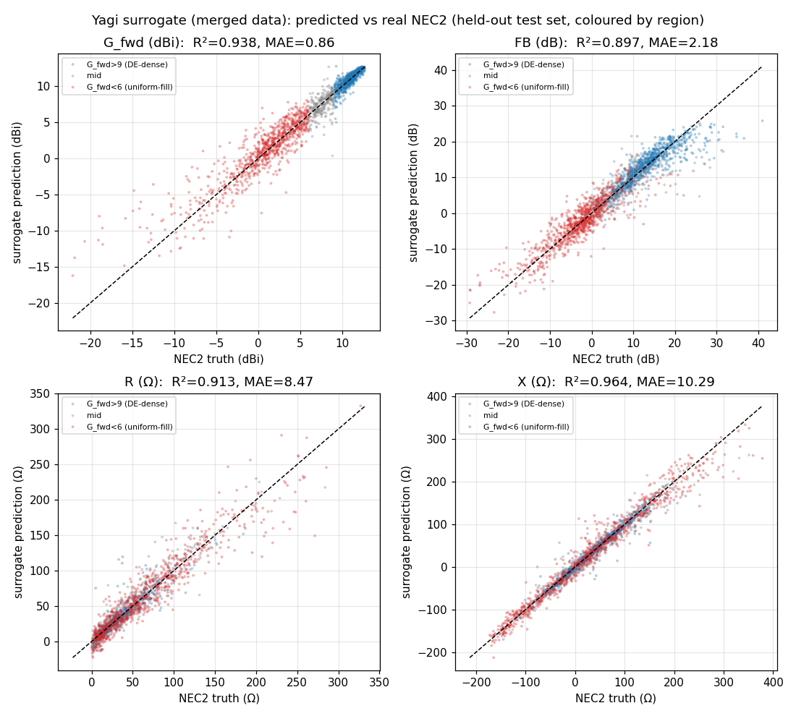

# Yagi performance surrogate model

## What this is (and what it is not)

This is a **surrogate model**: a small neural network that predicts a Yagi-Uda
antenna's performance from its 9 design parameters, trained on genuine NEC2
Method-of-Moments evaluations. It is a *fast approximation* of the real solver,
meant to give an instant estimate (intended for an interactive design preview).

It is **not** a replacement for NEC2. It interpolates real physics data; it does
not compute electromagnetics. Predictions carry real error (quantified below)
and occasionally miss badly on unusual designs. **Any value that matters should
be confirmed with a real NEC2 run** (`scripts/case_yagi.py` /
`yaf_solvers/nec2_adapter/`). The honest framing, consistent with the rest of
this project: *the surrogate accelerates exploration; the solver remains the
source of truth.*

Reproduce everything here with:

```bash
python3 scripts/train_surrogate.py
```

## Data — two real-NEC2 sources, merged (10 898 records)

The surrogate is trained on the **union of two real-NEC2 datasets**, both 5-element
Yagis at 300 MHz, each a 9-parameter design vector → `(G_fwd, F/B, R_in, X_in)`:

| source | records | how sampled | covers |
|--------|--------:|-------------|--------|
| `results/yagi_optimized.json` | 5 898 | differential-evolution sweep (`scripts/case_yagi.py`, seed 42) | the **high-gain corner** — clustered where the optimizer searched |
| `results/yagi_uniform_sample.json` | 5 000 | **uniform Latin-hypercube** over a widened box (`scripts/sample_yagi_dataset.py`) | the **whole space** — low/medium-gain regions and the corners the optimizer skipped |
| **merged** | **10 898** | — | even coverage across the design space |

Both sources are **real NEC2 (`necpp` MoM)** — no analytical model, no surrogate,
no synthetic values. They share the same 9 inputs and 4 targets, so they stack
directly.

- The DE file strips its per-evaluation parameter vectors to stay small, so the
  inputs are recovered by re-running the same deterministic seed-42 sweep
  (integrity check: 0 / 5898 forward-gain mismatches) and cached to
  `results/yagi_surrogate_dataset.npz`. The uniform file stores full inputs and
  outputs directly.

### Why the merge was necessary

The earlier model was trained on the DE sweep **alone**. Because an optimizer
concentrates its evaluations near good designs, that training set was biased to
the high-gain corner, and the model was effectively **blind below ~6 dBi**. The
uniform sample removes that bias: see `docs/yagi_uniform_sample.md` for the
coverage comparison (e.g. the DE history averages +10.3 dBi forward gain, the
uniform sample +1.9 dBi, and the uniform sample extends the range of every
output at both ends).

## Model

- Architecture: MLP `9 → 64 → 64 → 4`, ReLU. **5060 trainable parameters.**
- On-disk size: **~26 KB** (`models/surrogate_yagi.pt`, weights + normalization).
  The committed sidecar `models/surrogate_yagi.meta.json` carries the
  architecture, normalization statistics, per-region and overall test metrics in
  plain JSON for a future browser export.
- Inputs and outputs are standardized (zero-mean / unit-variance) using
  **training-set statistics only**, so the test set sees no leakage.
- Split: each source is split **20 % test / 80 % train** (10 % of train held out
  as a validation set for early stopping). The 20 % test slices are unioned into
  **one common test set of 2180 designs** (1180 optimized + 1000 uniform) that
  neither this model nor the baseline below ever trains on.

### Browser suitability

At 5060 parameters / ~26 KB, this model is trivially small for in-browser
inference (e.g. ONNX Runtime Web or a hand-written forward pass): a few thousand
multiply-adds per prediction, well under a millisecond. Size is not a concern;
accuracy is the gating factor (below).

## Accuracy (common held-out test set, 2180 designs, original units)

These are the merged model's metrics on the full-space test set:

| Target | Unit | MAE | RMSE | R² | p95 \|err\| | max | within preview band |
|---|---|---|---|---|---|---|---|
| `G_fwd` forward gain | dBi | 0.86 | 1.44 | 0.938 | 2.92 | 10.95 | **73.5 % ≤ 1 dBi** |
| `F/B` front-to-back  | dB  | 2.18 | 3.18 | 0.897 | 6.83 | 21.22 | 59.9 % ≤ 2 dB |
| `R_in` resistance    | Ω   | 8.47 | 13.80 | 0.913 | 27.43 | 122.19 | 71.7 % ≤ 10 Ω |
| `X_in` reactance     | Ω   | 10.29 | 16.67 | 0.964 | 35.49 | 123.35 | 66.2 % ≤ 10 Ω |

Scatter of predicted vs. real NEC2 on the test set, coloured by region (blue =
high-gain / DE-dense, red = low-gain / uniform-fill):



The within-band percentages are lower than the earlier model's headline numbers
**only because this test set is far harder**: it spans the whole design space,
including designs whose F/B swings from −36 to +52 dB, not just the well-behaved
high-gain corner. The right comparison — same model architecture, same protocol,
the *same* test points — is below.

## Merged vs optimized-only (apples-to-apples)

To measure what the uniform data bought, an **optimized-only baseline** was
trained under an *identical* protocol (same architecture, seeds, hyper-params;
only the training data differs) and evaluated on the *same* common test set.

**Validation that the baseline reproduces the earlier model.** On the
optimized-only slice of the test set — its own training distribution — the
baseline reproduces the previously reported numbers to three decimals (G_fwd MAE
0.44, R² 0.878, 91.4 % ≤ 1 dBi; F/B 75.2 % ≤ 2 dB; R 90.7 %; X 83.9 %). So the
baseline *is* the old model, and those good-looking numbers were measured only
on the high-gain distribution the model trained on.

**On the common, full-space test set, the optimized-only model collapses** — it
extrapolates wildly into the regions it never saw:

| Target | optimized-only | merged | improvement |
|---|---|---|---|
| `G_fwd` MAE | 3.79 dBi (R² −0.91) | **0.86 dBi (R² 0.94)** | 4.4× lower MAE, R² −0.91 → 0.94 |
| `G_fwd` within ±1 dBi | 56.6 % | **73.5 %** | +16.9 pp |
| `F/B` MAE | 5.98 dB (R² −0.25) | **2.18 dB (R² 0.90)** | 2.7× lower MAE |
| `F/B` within ±2 dB | 47.4 % | **59.9 %** | +12.5 pp |
| `R_in` MAE | 17.94 Ω (R² 0.50) | **8.47 Ω (R² 0.91)** | 2.1× lower MAE |
| `R_in` within ±10 Ω | 60.3 % | **71.7 %** | +11.4 pp |
| `X_in` MAE | 27.09 Ω (R² 0.65) | **10.29 Ω (R² 0.96)** | 2.6× lower MAE |
| `X_in` within ±10 Ω | 53.1 % | **66.2 %** | +13.1 pp |

The merged model wins on every target on equal footing — including **F/B, the
previously weakest metric**, whose MAE more than halves (5.98 → 2.18 dB) and
whose R² goes from negative to 0.90.

## Per-region accuracy — the headline

Splitting the common test set by true forward gain shows exactly where the
uniform data helped, and the (small) price paid for it.

**Low/medium-gain region — `G_fwd < 6 dBi` (886 test designs).** This was the
optimized-only model's blind spot. The merged model transforms it:

| Target | optimized-only MAE | merged MAE | within-band: opt → merged |
|---|---|---|---|
| `G_fwd` | 8.26 dBi | **1.43 dBi** | 11.6 % → **50.5 %** |
| `F/B`   | 11.38 dB | **2.47 dB** | 14.6 % → **51.2 %** |
| `R_in`  | 34.70 Ω  | **12.47 Ω** | 24.8 % → **53.6 %** |
| `X_in`  | 54.33 Ω  | **14.35 Ω** | 16.8 % → **49.1 %** |

Forward-gain MAE in this region drops ~5.8×; the model goes from useless (≈12 %
of designs within band) to roughly a coin-flip-plus within band on every metric.
This region is genuinely harder than the high-gain corner — outputs vary far more
widely — so ~50 % within the preview band is the realistic ceiling here, but it
is an enormous improvement over a model that was simply wrong.

**High-gain region — `G_fwd > 9 dBi` (1043 test designs).** The honest trade-off:
spreading model capacity across the whole space costs a *sliver* of sharpness in
the corner the old model specialized in.

| Target | optimized-only MAE | merged MAE | within-band: opt → merged |
|---|---|---|---|
| `G_fwd` | 0.32 dBi | 0.36 dBi | 96.3 % → 94.2 % |
| `F/B`   | 1.50 dB  | 1.76 dB  | 78.0 % → 69.1 % |
| `R_in`  | 3.56 Ω   | 4.42 Ω   | 93.5 % → 90.3 % |
| `X_in`  | 5.00 Ω   | 5.86 Ω   | 87.6 % → 84.0 % |

The regression is small (a few points of within-band, a few tenths of a dB / a
few Ω of MAE) and the high-gain region remains the model's strongest by far. In
exchange the model stops being blind everywhere else — a clearly worthwhile
trade for a tool meant to give feedback across the *whole* design space, not just
near the optimum.

## Honest verdict: good enough for a real-time preview?

**Yes across the whole space now — strongest near the optimum, usable in the
low/medium region, and never a final answer.**

- **Forward gain (`G_fwd`) — preview-grade everywhere.** 94 % within 1 dBi in the
  high-gain region and, crucially, MAE ~1.4 dBi in the low/medium region where
  the old model was off by ~8 dBi. Good enough to drive a live "roughly N dBi"
  readout and to rank designs while a user drags sliders, anywhere in the box.
- **Input impedance (`R_in`, `X_in`) — usable for guidance.** R² ≈ 0.91 / 0.96
  over the full space. Fine for a coarse "roughly matched to 50 Ω or not"
  indicator; not precise enough for matching-network design.
- **Front-to-back ratio (`F/B`) — much improved, still the weakest.** MAE more
  than halved versus the old model on equal footing (5.98 → 2.18 dB) and R² now
  0.90, but F/B is a *difference* of two gains and stays the hardest quantity to
  approximate (≈60 % within 2 dB overall). Display it as an approximate trend.
- **All targets — a screening tool, not a verifier.** Tail errors mean the
  surrogate can still be very wrong on an individual design. The correct product
  pattern is: surrogate for instant feedback and ranking → real NEC2 to confirm
  any design the user wants to keep.

## Browser deployment (client-side inference)

Because the model is tiny, it runs entirely in the browser with **no server, no
ML runtime, and no third-party dependency** — a few thousand multiply-adds per
prediction. Rather than ship ONNX Runtime Web (a multi-MB bundle to evaluate
~5060 weights), the weights and normalization statistics are exported to plain
JSON and a ~40-line hand-written forward pass does the work (see ADR-014).

Reproduce the export with:

```bash
python3 scripts/export_surrogate_web.py
node scripts/verify_web_surrogate.mjs    # JS-vs-PyTorch parity gate
```

Artifacts (in `frontend/`):

| file | what |
|------|------|
| `surrogate_infer.js` | the forward pass (standardize → dense+ReLU layers → de-standardize); loadable as a browser global or a Node module, so one implementation backs both the page and the parity check |
| `surrogate_yagi.web.json` | exported weights, normalization, input ranges, and a verification block of test inputs carrying the PyTorch model's own predictions |
| `surrogate_demo_test.html` | self-contained page (engine + model + cases inlined) that re-runs every case in-browser, shows the JS-vs-PyTorch difference, and has a live slider predictor — opens from `file://`, no server |

**Verification — JS matches PyTorch.** `scripts/verify_web_surrogate.mjs` runs the
exported model through the JavaScript forward pass and compares every output to
the PyTorch prediction baked into the export. Across 7 diverse designs (the
optimized best, low/median/high-gain uniform samples, both box edges, and a
textbook-like design — 28 outputs total):

- **all 28 outputs within the 0.01 tolerance**, with **max |JS − PyTorch| = 9.4e-5**.
- The residual is float32 (PyTorch) vs float64 (JS) rounding, not a logic
  difference; normalization, weight layout, and layer order all line up.

**Size and speed.** The weight JSON is ~166 KB raw / **~52 KB gzipped**; the
demo page ~120 KB / ~54 KB gzipped. Inference measured in V8 (the same engine
as Chrome) is **~8.7 µs per prediction (~115 k predictions/second)** — far faster
than a slider can move, so a live "drag to see G_fwd / F/B / R / X" preview is
comfortably real-time.

## Known limitations

- **Domain.** Trained only on 5-element Yagis at 300 MHz within (and modestly
  beyond) the `scripts/case_yagi.py` parameter bounds. It says nothing about
  other element counts, frequencies, or antenna types, and offers no
  extrapolation guarantees outside the sampled box.
- **Hardest in the low/medium-gain region.** Coverage is now even, but that
  region's outputs vary far more widely, so within-band rates there (~50 %) are
  lower than in the high-gain corner — a property of the physics, not of biased
  sampling.
- **Tail errors.** A few percent of designs are predicted poorly (see `p95` /
  `max`), particularly impedance near anti-resonance.
- **No uncertainty estimate.** The model returns a point prediction with no
  confidence flag, so it cannot itself tell you which predictions to distrust —
  another reason to confirm kept designs with the real solver.
- **Single-frequency, single operating point.** No bandwidth, no pattern, no
  sweep — just the four scalar metrics at the design frequency.
